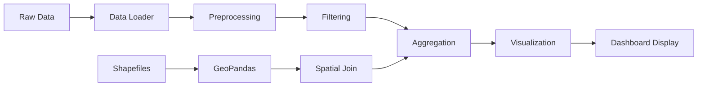

# 🦌 Citizen Science Wildlife Monitoring Dashboard

<div align="center">

[](https://streamlit.io)
[](https://www.python.org)
[](LICENSE)
[](http://doi.org/10.7818/ecos.2848)

**Interactive Intelligence Panel for Wildlife Conservation in Córdoba Province, Spain**

*Combining camera trapping, citizen science platforms, and educational outreach to advance mammal distribution knowledge*

[📊 View Dashboard](#-quick-start) • [📖 Documentation](#-documentation) • [🔬 Research Paper](http://doi.org/10.7818/ecos.2848) • [👥 Contributors](#-team-and-acknowledgments)

</div>

---

## Table of Contents

- [Overview](#overview)
- [Key Features](#key-features)
- [Project Context](#project-context)
- [Data Sources](#data-sources)
- [Repository Structure](#repository-structure)
- [Quick Start](#quick-start)
- [Dashboard Sections](#dashboard-sections)
- [Technical Architecture](#technical-architecture)
- [Data Pipeline](#data-pipeline)
- [Visualizations](#visualizations)
- [Documentation](#documentation)
- [Research Background](#research-background)
- [Team and Acknowledgments](#team-and-acknowledgments)
- [Citation](#citation)
- [Contributing](#contributing)
- [License](#license)

---

## Overview

This repository hosts a **comprehensive Streamlit-based intelligence dashboard** for exploring, analyzing, and visualizing wildlife monitoring data from a pioneering citizen science initiative in Córdoba, Spain. Over four months (January-April 2024), **800 students from 11 educational centers** deployed camera traps and generated **1,605 sequence records** documenting **15 wild mammal species**—data volume comparable to 15 years of GBIF records in the same area.

The dashboard integrates:
- 🎥 **Camera trap sequences** from school-based monitoring
- 🌍 **GBIF occurrence data** (2008-2023)
- 👥 **Citizen science platforms** (iMammalia, iNaturalist, Observation.org)
- 📍 **Geospatial analysis** with UTM 10×10 km grid overlays

**What makes this project unique:**
- **Educational impact**: 800 young citizen scientists actively engaged in hypothesis design, data collection, and analysis
- **Data quality**: Verifiable camera trap evidence complementing volunteer observations
- **Scale**: School-based effort generated data comparable to 15 years of expert observations
- **Conservation value**: Documented previously unconfirmed species and identified sampling gaps

---

## Key Features

### Core Capabilities

| Feature | Description |
|---------|-------------|
| **📊 Interactive Data Exploration** | Filter and explore 1,605+ wildlife records by species, UTM grid, and data source with real-time updates |
| **📈 Advanced Statistical Analysis** | Distribution analysis, correlation studies, outlier detection, and robust statistical summaries |
| **🗺️ Geospatial Intelligence** | Interactive maps with clustering, heat maps, camera trap locations, and UTM grid overlays |
| **🔍 Multi-Source Integration** | Seamlessly compare camera traps, GBIF, and citizen science platforms |
| **💡 Evidence-Based Insights** | Key findings, hotspot identification, and strategic conservation recommendations |
| **📥 Data Export** | Download filtered datasets, summaries, and high-resolution visualizations |
| **🎨 Professional UI/UX** | Custom CSS styling, responsive design, and intuitive navigation |

### 🔬 Analysis Modules

1. **Distribution Analysis**: Histogram visualizations, log-transform views, statistical summaries
2. **Correlation Studies**: Daily vs Sequences records with outlier sensitivity analysis
3. **Species Richness**: Platform comparison, unique species tracking, complementarity assessment
4. **Spatial Patterns**: Hotspot detection, coverage gap identification, grid-level breakdown
5. **Temporal Trends**: Year-over-year accumulation curves by taxonomic groups
6. **Multi-Dimensional Views**: Sunburst charts, hierarchical plots, faceted comparisons

---

## Project Context

### The Challenge

Traditional wildlife distribution atlases rely on sparse, expert-driven observations accumulated over decades. This project demonstrates that **structured citizen science with educational centers can generate high-quality, verifiable data at unprecedented scale**.

### The Approach

**IncluScience-Me** and **ConCiencia-2** projects engaged 11 educational centers in Córdoba province to:
1. Deploy camera traps near schools (57 locations across 11 UTM grids)
2. Train students in scientific methodology and data collection
3. Generate verifiable photographic evidence over 4 months (Jan-Apr 2024)
4. Compare results with 15 years of GBIF data (2008-2023)

### The Results

| Metric | Value | Context |
|--------|-------|---------|
| **Students involved** | 800 | Ages 4-12 from 11 schools |
| **Camera trap records** | 1,605 sequences | 589 daily records |
| **Species documented** | 15 wild mammals | Including previously unconfirmed species |
| **Spatial coverage** | 11 UTM grids | 10×10 km cells |
| **Data comparability** | 1:1 ratio | 4 months ≈ 15 years GBIF |

---

## Data Sources

### Primary Datasets

| Dataset | Format | Description | Records |
|---------|--------|-------------|---------|
| **Camera Traps (2024)** | CSV | School-based camera sequences & daily records | 1,605 sequences |
| **GBIF Occurrences** | Shapefile | Historical observations (2008-2023) | 1,235 points |
| **UTM Grid** | Shapefile | 10×10 km spatial grid for Córdoba | 11 grids |
| **Camera Locations** | CSV | GPS coordinates of 57 camera sites | 57 locations |
| **Species Silhouettes** | CSV | URLs for species icons in map popups | 15 species |

### Data Structure

#### `dataset_CSsources_mod.csv` (Main Dataset)
```
Species.Name | Grid   | Data.Source         | Records
-------------|--------|---------------------|--------
O.cuniculus  | UG18   | Sequences Record    | 245
S.scrofa     | UG28   | Daily Record        | 87
V.vulpes     | UG27   | Global Biodiversity | 34
```

**Data Sources:**
- `Sequences Record`: Camera trap sequences (multiple photos of same event)
- `Daily Record`: School observation logs (daily presence/absence)
- `Global Biodiversity`: GBIF platform aggregation
- `No Validation`: Citizen science platforms (iMammalia, iNaturalist, Observation.org)

#### GBIF Shapefile Attributes
- **geometry**: Point locations (latitude/longitude)
- **genus**: Taxonomic genus
- **institut_1**: Platform/institution (iMammalia, iNaturalist, Observation.org)
- **year**: Observation year (2008-2023)
- **order**: Taxonomic order (for trend analysis)

---

## Repository Structure

```
Citizen_Science/
│
├── app/                          # Streamlit dashboard application
│   ├── app.py                    # Main entry point
│   ├── config.py                 # Central configuration
│   ├── data_loader.py            # Data loading & preprocessing
│   ├── visualizations.py         # Plotly chart generators
│   ├── styles.py                 # Custom CSS & UI components
│   ├── requirements.txt          # Python dependencies
│   │
│   └── pages/                    # Modular page components
│       ├── origin.py             # Project context & methodology
│       ├── data_exploration.py   # Interactive data filters & maps
│       ├── eda.py                # Statistical analysis & visualizations
│       ├── conclusions.py        # Key findings & recommendations
│       └── ml.py                 # Machine learning (future work)
│
├── data/                         # Raw and processed datasets
│   ├── dataset_CSsources_mod.csv # Main citizen science records
│   ├── GBIFdata_CO.shp           # GBIF occurrence points
│   ├── CO_UTM2.shp               # UTM grid polygons
│   ├── locCam3.csv               # Camera trap coordinates
│   └── siluetas.csv              # Species silhouette URLs
│
├── notebooks/                    # Jupyter notebooks for EDA
│   ├── eda.ipynb                 # Exploratory data analysis
│   └── prep.ipynb                # Data preprocessing pipeline
│
├── img/                          # Generated static visualizations
│   ├── correlation_daily_sequences.png
│   ├── species_richness_by_source.png
│   ├── records_by_species_grid.png
│   ├── accumulated_curves_orders.png
│   └── ...
│
├── html/                         # Interactive HTML maps
│   ├── mapa_clusters_por_grid.html
│   └── mapa_calor_con_utm_y_camaras.html
│
├── doc/                          # Documentation
│   ├── info.md                   # Project overview & methodology
│   ├── eda.md                    # EDA storytelling guide
│   └── summary.md                # Executive summary
│
├── CHANGELOG.md                  # Detailed version history
├── LICENSE                       # License information
└── README.md                     # This file
```

---

## Quick Start

### Prerequisites

- **Python 3.8+** installed
- **Git** for cloning the repository
- **pip** package manager

### Installation (5 minutes)

```bash
# 1. Clone the repository
git clone https://github.com/your-username/Citizen_Science.git
cd Citizen_Science

# 2. Create virtual environment (recommended)
python -m venv venv

# Activate virtual environment
# Windows:
.\venv\Scripts\activate
# macOS/Linux:
source venv/bin/activate

# 3. Install dependencies
cd app
pip install -r requirements.txt

# 4. Launch the dashboard
streamlit run app.py
```

The dashboard opens automatically at **http://localhost:8501** 🎉

### Quick Test

After launch, you should see:
- ✅ Interactive sidebar with filters
- ✅ Custom navigation menu (5 sections)
- ✅ Main dashboard with wildlife data
- ✅ Interactive maps and charts

---

## Dashboard Sections

### 1️⃣ **📚 Project Origin & Context**

Comprehensive project background and methodology:
- **Overview**: Initiative goals and educational scope
- **Study Area**: Córdoba province geographic context
- **Participants**: 11 schools, 800 students (ages 4-12)
- **Timeline**: January-April 2024 (4 months)
- **Methodology**: Camera trap deployment, data comparison framework
- **Scientific Reference**: Full citation with DOI

**Key Metrics Highlighted:**
- 800 student participants
- 15 wild mammal species documented
- 11 UTM grids covered
- 57 camera trap locations

---

### 2️⃣ **🔍 Data Exploration**

Interactive exploration with real-time filtering:

#### **Filters** (Sidebar)
- Species selection (15+ species)
- UTM Grid filter (11 grids)
- Data Source (4 types)
- Minimum records threshold

#### **Tabs:**

**📋 Raw Data View**
- Complete dataset table with sorting
- Download filtered data as CSV
- Real-time record counts

**🦊 By Species**
- Species-level aggregations
- Records per species by source
- Top species rankings
- Download species summary

**📐 By Grid**
- UTM grid analysis
- Spatial distribution metrics
- Grid detail explorer
- Hotspot identification

**🌐 By Source**
- Platform comparison
- Data source richness
- Unique species per source
- Complementarity analysis

**🗺️ Interactive Maps**
- **Cluster Map**: GBIF points with MarkerCluster + UTM overlays + species silhouettes
- **Heat Map**: Density visualization + 57 camera locations + 6-color gradient
- **Custom Builder**: Configure your own map views (future feature)

---

### 3️⃣ **📊 Exploratory Data Analysis (EDA)**

Advanced statistical visualizations:

#### **Distribution Analysis**
- Histograms: Sequences vs Daily records
- Log-transform views for skewed data
- Statistical summaries (mean, median, quartiles)
- Outlier detection with violin plots

#### **Correlation Studies**
- Daily Records vs Sequences scatter plot
- Pearson correlation with regression line
- **Outlier sensitivity**: Toggle top species to reveal underlying patterns
- Comparison view (with/without *O. cuniculus*)

#### **Species Richness**
- Bar charts: Species count per platform
- Platform complementarity analysis
- Unique vs shared species
- Contribution percentages

#### **Spatial Patterns**
- Faceted bar charts: Species × Grid × Source
- Top grids with highest diversity
- Coverage gap visualization
- Heatmap overlays

#### **Temporal Trends**
- Accumulated curves by taxonomic order
- Year-over-year comparison (2008-2023)
- Trajectory analysis (growth/decline)
- Platform evolution over time

#### **Multi-Dimensional Views**
- Sunburst charts (hierarchical data)
- Nested proportions by taxonomy/source
- Interactive drill-down

---

### 4️⃣ **💡 Key Findings & Recommendations**

Evidence-based insights for stakeholders:

#### **Main Findings**
1. **Data Volume**: 4 months of school monitoring ≈ 15 years GBIF
2. **Species Discovery**: Previously unconfirmed species documented
3. **Spatial Gaps**: Under-sampled grids identified
4. **Platform Complementarity**: Different platforms capture different species

#### **Recommendations**
- **Spatial Strategy**: Target under-sampled grids for future deployments
- **Platform Integration**: Combine camera traps with volunteer platforms
- **Quality Assurance**: Implement validation protocols
- **Educational Scaling**: Expand to more schools

#### **Strategic Roadmap**
- Short-term: Balance spatial coverage
- Medium-term: Integrate environmental layers
- Long-term: Automated species ID with AI

---

### 5️⃣ **🤖 Machine Learning** (Future Work)

Planned AI/ML capabilities:
- Species distribution models (SDMs)
- Automated species identification from images
- Anomaly detection and early warning systems
- Predictive modeling for conservation planning

---

## Technical Architecture

### Design Principles

| Principle | Implementation |
|-----------|----------------|
| **Modularity** | Separate concerns: data, visualization, styling, configuration |
| **Reusability** | Functions designed for flexible reuse across pages |
| **Performance** | Streamlit `@st.cache_data` for expensive operations |
| **Maintainability** | Clear documentation, consistent naming, type hints |
| **Extensibility** | Easy to add new analyses, visualizations, data sources |

### Key Components

#### `config.py` - Central Configuration
```python
# File paths
DATA_DIR = BASE_DIR / "data"
IMG_DIR = BASE_DIR / "img"

# Color schemes
DATA_SOURCE_COLORS = {
    'Global Biodiversity': '#228B22',
    'Sequences Record': '#4169E1',
    # ...
}

# Map settings
MAP_CONFIG = {
    'center_lat': 37.6,
    'center_lon': -4.5,
    'default_zoom': 9
}
```

#### `data_loader.py` - Data Pipeline
- `load_citizen_science_data()`: CSV loading with caching
- `load_shapefile_data()`: Geospatial data processing
- `aggregate_by_grid()`: Spatial aggregation
- `filter_data()`: Interactive filtering logic

#### `visualizations.py` - Chart Library
- `plot_histogram()`: Distribution charts
- `plot_correlation()`: Scatter plots with regression
- `plot_species_richness()`: Bar charts
- `plot_temporal_trends()`: Time series
- `plot_sunburst()`: Hierarchical visualizations

#### `styles.py` - UI Components
```python
# Custom CSS injection
def apply_custom_css():
    st.markdown("""
    <style>
    [data-testid="stSidebarNav"] { display: none; }
    /* Custom navigation, colors, fonts */
    </style>
    """, unsafe_allow_html=True)

# Reusable UI elements
def create_highlight_box(content, box_type='info'):
    # Returns styled info/success/warning boxes
```

---

## Data Pipeline

### Workflow Overview



### Processing Steps

1. **Data Loading** (`data_loader.py`)
   - Load CSV with pandas
   - Load shapefiles with geopandas
   - Handle missing values and inconsistent formats

2. **Preprocessing**
   - Standardize species names
   - Align data source labels
   - Convert coordinates to consistent CRS

3. **Spatial Operations**
   - Spatial join: GBIF points → UTM grids
   - Camera trap location mapping
   - Grid-level aggregations

4. **Aggregation**
   ```python
   def aggregate_by_grid(df):
       return df.groupby('Grid').agg({
           'Records': 'sum',  # Total_Records
           'Species.Name': 'nunique',  # Num_Species
           'Data.Source': 'nunique'  # Num_Sources
       }).reset_index()
   ```

5. **Caching Strategy**
   - `@st.cache_data` for data loading
   - `@st.cache_resource` for shapefile processing
   - Cache invalidation on filter changes

---

## Visualizations

### Static Outputs (`img/` directory)

| Visualization | Description | Use Case |
|---------------|-------------|----------|
| `correlation_daily_sequences.png` | Scatter plot with regression line | Assess platform alignment |
| `correlation_comparison.png` | With/without outliers | Outlier sensitivity analysis |
| `species_richness_by_source.png` | Bar chart by platform | Platform comparison |
| `records_by_species_grid.png` | Faceted bar charts | Spatial species composition |
| `accumulated_curves_orders.png` | Time series by order | Temporal trends |
| `panel_mapps_heat.png` | KDE heatmaps by genus | Spatial density patterns |

### Interactive Maps (`html/` directory)

#### **Cluster Map** (`mapa_clusters_por_grid.html`)
- **Technology**: Folium + MarkerCluster
- **Data**: 1,235 GBIF points across 11 grids
- **Features**:
  - Cluster numbers show observation count
  - Click to zoom and reveal individual markers
  - Color-coded by platform (orange/green/blue)
  - Species silhouettes in popups
  - UTM grid overlay (purple, opacity 0.3)

#### **Heat Map** (`mapa_calor_con_utm_y_camaras.html`)
- **Technology**: Folium HeatMap plugin
- **Data**: All observations + 57 camera locations
- **Features**:
  - 6-color gradient (blue → red)
  - Camera trap icons (black camera symbols)
  - UTM grid overlay (purple, opacity 0.2)
  - Hotspot identification
  - Coverage gap visualization

---

## Documentation

### Available Guides

| Document | Purpose | Audience |
|----------|---------|----------|
| `doc/info.md` | Project overview & methodology | General public, educators |
| `doc/eda.md` | EDA storytelling guide | Analysts, researchers |
| `CHANGELOG.md` | Version history & improvements | Developers, contributors |
| `app/README.md` | Dashboard-specific documentation | Dashboard users |
| `app/QUICKSTART.md` | Installation & usage guide | New users |

### Key Resources

- **📊 EDA Narrative** (`doc/eda.md`): Detailed storytelling of analysis journey
- **🔧 Implementation Summary** (`app/IMPLEMENTATION_SUMMARY.md`): Technical decisions
- **📝 Changelog** (`CHANGELOG.md`): All improvements documented with prompts used

---

## Research Background

### Published Study

**Title**: *Fototrampeo en las Aulas: Oportunidades de la Ciencia Ciudadana para Contribuir al Conocimiento de la Distribución de los Mamíferos Silvestres* (Camera Trapping in Classrooms: Opportunities for Citizen Science to Contribute to Knowledge of Wild Mammal Distribution)

**Authors**: Murillo Jiménez, T., Ferrer Ferrando, D., Olivares Collado, C., Guerrero Casado, J., & Blanco-Aguiar, J. A.

**Journal**: *Ecosistemas*, 34(1), 2848 (2025)

**DOI**: [10.7818/ecos.2848](http://doi.org/10.7818/ecos.2848)

**Publisher**: Asociación Española de Ecología Terrestre (AEET)

### Research Questions

1. Can school-based camera trapping generate data volumes comparable to historical platforms?
2. Do camera traps detect species missed by traditional citizen science?
3. What spatial patterns emerge from integrated data sources?
4. How do different platforms complement each other?

### Key Findings

- ✅ **Data Volume**: 4 months = 15 years of GBIF records
- ✅ **Species Discovery**: Documented previously unconfirmed species
- ✅ **Spatial Insights**: Identified hotspots and sampling gaps
- ✅ **Platform Synergy**: Each source captures unique species subset

### Project Funding

- **IncluScience-Me**: Educational science outreach program
- **ConCiencia-2**: Citizen science capacity building
- **Momentum CSIC**: [Desarrolla tu Talento Digital](https://momentum.csic.es/)

---

## Team and Acknowledgments

### Core Research Team

| Name | Role | Affiliation |
|------|------|-------------|
| **T. Murillo Jiménez** | Lead Researcher | Universidad de Castilla-La Mancha |
| **D. Ferrer Ferrando** | Data Analysis | Universidad de Castilla-La Mancha |
| **C. Olivares Collado** | Education Coordination | Universidad de Castilla-La Mancha |
| **J. Guerrero Casado** | Wildlife Ecology | Universidad de Castilla-La Mancha |
| **J. A. Blanco-Aguiar** | Project Director | CSIC/UCLM |

### Contributors

- **800 students** from 11 educational centers (ages 4-12)
- **Teachers and coordinators** facilitating camera trap deployments
- **Local communities** in Córdoba province providing site access
- **GBIF** for historical occurrence data
- **Citizen science platforms**: iMammalia, iNaturalist, Observation.org

### Educational Centers

11 schools across Córdoba province participated in IncluScience-Me and ConCiencia-2 projects, deploying 57 camera traps across 11 UTM grids (10×10 km).

---

## Citation

### For the Dashboard/Repository

```bibtex
@software{citizen_science_dashboard_2025,
  title = {Citizen Science Wildlife Monitoring Dashboard},
  author = {Murillo Jiménez, T. and Ferrer Ferrando, D. and Olivares Collado, C. and Guerrero Casado, J. and Blanco-Aguiar, J. A.},
  year = {2025},
  url = {https://github.com/your-username/Citizen_Science},
  note = {Interactive Streamlit dashboard for wildlife conservation data analysis}
}
```

### For the Research Paper

```bibtex
@article{murillo2025camera,
  title = {Fototrampeo en las Aulas: Oportunidades de la Ciencia Ciudadana para Contribuir al Conocimiento de la Distribución de los Mamíferos Silvestres},
  author = {Murillo Jiménez, T. and Ferrer Ferrando, D. and Olivares Collado, C. and Guerrero Casado, J. and Blanco-Aguiar, J. A.},
  journal = {Ecosistemas},
  volume = {34},
  number = {1},
  pages = {2848},
  year = {2025},
  publisher = {Asociación Española de Ecología Terrestre (AEET)},
  doi = {10.7818/ecos.2848},
  url = {http://doi.org/10.7818/ecos.2848}
}
```

---

## Contributing

We welcome contributions from the community! Here's how you can help:

### Ways to Contribute

- 🐛 **Report bugs**: Open an issue with detailed reproduction steps
- 💡 **Suggest features**: Propose new analyses or visualizations
- 📝 **Improve documentation**: Fix typos, add examples, clarify instructions
- 🔧 **Submit code**: Fix bugs, add features, optimize performance
- 📊 **Share data**: Contribute additional datasets or validation

### Development Workflow

1. **Fork** the repository
2. **Create** a feature branch
   ```bash
   git checkout -b feature/amazing-feature
   ```
3. **Make** your changes following style guidelines
4. **Test** thoroughly (all pages, filters, visualizations)
5. **Commit** with clear messages
   ```bash
   git commit -m "Add: New visualization for temporal trends"
   ```
6. **Push** to your fork
   ```bash
   git push origin feature/amazing-feature
   ```
7. **Open** a Pull Request with detailed description

### Development Guidelines

- **Style**: Follow PEP 8 for Python code
- **Documentation**: Add docstrings to all functions
- **Type Hints**: Include where applicable
- **Testing**: Verify changes don't break existing functionality
- **Dependencies**: Update `requirements.txt` if adding libraries

### Code Review Process

All contributions will be reviewed for:
- ✅ Code quality and style consistency
- ✅ Functionality and correctness
- ✅ Documentation completeness
- ✅ Compatibility with existing features

---

## License

This project is developed for **academic and educational purposes** as part of the IncluScience-Me and ConCiencia-2 initiatives.

### Usage Terms

- ✅ **Academic use**: Free for research and education
- ✅ **Non-commercial**: Free for conservation organizations
- ✅ **Attribution**: Must cite original research paper
- ❌ **Commercial use**: Contact authors for licensing

### Data Licensing

- **Camera trap data**: © 2024 IncluScience-Me Project
- **GBIF data**: Subject to GBIF data use agreement
- **Citizen science platforms**: Respective platform licenses apply

For commercial licensing or custom integrations, contact the project team.

---

## Contact and Support

### Get in Touch

- **📧 Email**: [Project contact - add email]
- **🌐 Project Website**: [Add project URL]
- **📝 GitHub Issues**: [Report bugs or request features](https://github.com/your-username/Citizen_Science/issues)
- **💬 Discussions**: [Ask questions or share ideas](https://github.com/your-username/Citizen_Science/discussions)

### Support Channels

- **Documentation**: Check `doc/` folder and inline code comments
- **FAQ**: [Add link to FAQ if available]
- **Community Forum**: [Add link if available]

---

## Roadmap

### Version 1.0 (Current) ✅
- ✅ Core dashboard with 5 sections
- ✅ Interactive data exploration and filtering
- ✅ Advanced EDA with statistical visualizations
- ✅ Interactive maps (cluster, heat, camera locations)
- ✅ Data export capabilities
- ✅ Custom CSS styling and professional UI

### Version 1.1 (In Progress) 🚧
- 🚧 Enhanced temporal analysis (monthly/seasonal trends)
- 🚧 Improved map interactivity (custom layer toggles)
- 🚧 Additional statistical tests (chi-square, ANOVA)
- 🚧 Performance optimizations for large datasets

### Version 2.0 (Planned) 🔮
- 🔮 Machine learning integration
  - Species distribution models (SDMs)
  - Automated species identification from images
  - Anomaly detection for rare species
- 🔮 Real-time data feeds from camera traps
- 🔮 Mobile app companion for field data collection
- 🔮 Multi-language support (English/Spanish)
- 🔮 Environmental layers (land cover, elevation, climate)
- 🔮 API for programmatic access

### Community Requests 💭
- User authentication and personalized dashboards
- Export reports as PDF/PowerPoint
- Integration with eBird and other biodiversity platforms
- Collaborative annotation tools for species validation

---

## Acknowledgments

Special thanks to:

- **Educational centers and teachers** for deploying camera traps and engaging students
- **800 young citizen scientists** for their enthusiasm and dedication
- **Local communities** in Córdoba for site access and support
- **GBIF** for open biodiversity data infrastructure
- **Citizen science platforms** (iMammalia, iNaturalist, Observation.org) for complementary data
- **Momentum CSIC** for funding and capacity building
- **Open-source community** for libraries (Streamlit, Plotly, Folium, Pandas, GeoPandas)

---

## Project Stats

<div align="center">

| Metric | Value |
|--------|-------|
| **Students Engaged** | 800 |
| **Schools Participating** | 11 |
| **Camera Traps Deployed** | 57 |
| **Species Documented** | 15 |
| **Camera Trap Records** | 1,605 sequences |
| **Daily Observations** | 589 |
| **UTM Grids Covered** | 11 (10×10 km) |
| **GBIF Historical Points** | 1,235 (2008-2023) |
| **Monitoring Period** | 4 months (Jan-Apr 2024) |
| **Code Lines** | ~5,000+ |
| **Dependencies** | 15+ Python libraries |

</div>

---

## 🌟 Star History

If you find this project useful, please consider giving it a ⭐ on GitHub!

[](https://star-history.com/#your-username/Citizen_Science&Date)

---

<div align="center">

**Built with ❤️ for wildlife conservation and education**

[⬆ Back to Top](#-citizen-science-wildlife-monitoring-dashboard)

</div>
